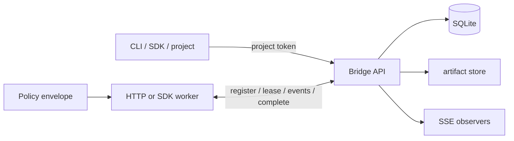

# Ferryman

Ferryman is a self-hostable, provider-neutral control plane for durable AI-assisted work. It is local-files-first: every project gets a private local Git workspace, and independent workers lease and complete jobs through a small HTTP protocol. The bridge persists state, artifacts, audit events, and approval decisions without owning model execution.

> v0.1 is a local, single-node reference implementation. It provides durable SQLite jobs, project-scoped bearer tokens, approval gates, worker leases, artifacts, retries, and SSE event streams. It is not a security sandbox or a distributed scheduler.

For the public-release hardening path, see [the release plan](docs/PUBLIC_RELEASE_PLAN.md). Until then, treat this repository as a preview/reference implementation rather than production infrastructure.



## Prerequisites

- A stable **Rust** toolchain (
ustup recommended).
- **Linux only:** the OS credential-store backend (the keyring crate) needs D-Bus development headers.
  On Debian/Ubuntu: `sudo apt-get install -y libdbus-1-dev pkg-config`. On Fedora/RHEL: `sudo dnf install dbus-devel pkgconf`.
  macOS and Windows use their native keychains and need no extra system packages.

## Quick start

```powershell
cargo run -p ferryman-server -- --database ./.data/bridge.db --artifacts ./.data/artifacts
# In another terminal (the server starts with a seeded demo project):
cargo run -p ferryman-cli -- --token demo-local-token jobs submit --project demo --input '{"prompt":"make a report"}' --requires-approval
cargo run -p ferryman-cli -- --token demo-local-token jobs approve --project demo <job-id>
# Follow actual Server-Sent Event output:
cargo run -p ferryman-cli -- --token demo-local-token jobs tail --project demo <job-id>
# Start an intentionally harmless mock worker:
cargo run -p ferryman-worker-sdk --example mock_worker
```

The bridge listens on `127.0.0.1:8787` by default. Watch events with `GET /v1/projects/demo/jobs/<job-id>/events` and `Authorization: Bearer demo-local-token`.
Copy `config/bridge.example.toml` into deployment configuration as a reference; the v0.1 CLI flags are the active server configuration surface.

## Public API and layout

- `openapi/openapi.yaml` is the versioned HTTP contract (`/v1`).
- `crates/ferryman-core` owns durable types, policies, storage, and the adapter contract.
- `crates/ferryman-server` owns Axum routes and single-node orchestration.
- `crates/ferryman-cli` is the operator/client CLI.
- `crates/ferryman-worker-sdk` contains HTTP protocol models and an example worker.
- `examples/report-project` is a language-neutral integration example.

## Local files, private repositories, and agents

The default project root is `./.data/projects/<project-slug>`. Creating a project initializes a local Git repository on `main`, writes `.ferryman/REPOSITORY.md`, and never adds a remote or publishes anything. If the same bridge configuration is used on a different device, it creates a fresh local repository with the same project-slug naming convention. The bridge refuses workspaces that already contain a Git remote, rather than risk treating an unknown remote as private.

Artifacts default to `./.data/artifacts`, including when a mapped/network HDD exists. Network storage is a named recovery target—not a preferred live-artifact location. The strict recovery order is local disk, configured network storage, encrypted Google Drive, encrypted MEGA, then an encrypted bundle on a private Git recovery branch. External adapters are disabled until a project names a target, supplies a credential/key reference, and approves the exact consent manifest; raw artifacts are never post-write mirrored.

Agents are named from their project and role—for example `saturday-80s-visual-qa`, never `agent-1`. `POST /v1/projects/{project_id}/agents` creates a **temporal** or **permanent** agent and writes its portable role profile to `.ferryman/agents/<name>.md`. See [the agent model](docs/AGENT_MODEL.md).

## Bridge-owned project memory

The bridge also maintains append-only project memory outside both the agent and the project workspace. It is recorded in SQLite and mirrored to `./.data/bridge-memory/<project-slug>/MEMORY.md` by default, so an orchestrator or agent that lost context can reload project decisions, constraints, and handoffs. The Bridge supplies recovery context; it does not reason, plan, or act as an orchestrator/agent. Use the `memory add` / `memory list` CLI commands or `/v1/projects/{project_id}/memory`; see [the recovery model](docs/PROJECT_MEMORY.md).

For recovery and portability, `POST /v1/projects/{project_id}/continuity-packs` creates an encrypted, compressed all-retained-artifact pack with authenticated manifest; import/recovery is verified and read-only, and `POST /v1/projects/{project_id}/recovery-drill` tests it without dispatching work. In local development the server starts with no recovery key configured: it mints an ephemeral key and logs a warning, so the quickstart works out of the box (continuity packs sealed during that run are not recoverable after a restart). Set `FERRYMAN_RECOVERY_KEY_HEX` to a stable 64-hex value for reproducible local recovery; production retrieves `FERRYMAN_RECOVERY_KEY_REFERENCE=keychain:service:account` from the OS keychain. See [continuity and improvement](docs/CONTINUITY_AND_IMPROVEMENT.md).

For two trusted Windows machines, the private Git recovery target is functional now: it stores only encrypted packs and authenticated manifests in a separate private repository. Pair the recovery key through a one-time encrypted file, then use the consent-approved CLI flow in [two-machine recovery](docs/TWO_MACHINE_RECOVERY.md). Google Drive and MEGA are planned optional targets, not yet enabled.

Set `FERRYMAN_MEMORY_WRITE_TOKEN` on the server and `FERRYMAN_MEMORY_TOKEN` only for your trusted operator/client to prevent workers from appending memory. Existing entries are append-only either way.

## Security model

Each project has its own bearer token. Tokens are stored as SHA-256 hashes, never returned after creation, and authorize only that project. In `--production` mode, project creation requires `FERRYMAN_ADMIN_TOKEN` and the demo project is disabled. Worker registration returns a distinct eight-hour worker token exactly once; worker tokens are limited to worker protocol routes and cannot write memory, approve consent, access recovery keys, or create outbound submissions. Secrets are references (`env:NAME` or `keychain:NAME`), never values, and the API redacts sensitive fields from event payloads. `shell` execution is not implemented; a future local shell adapter must require an explicit unsafe flag and a restrictive policy.

Approval is explicit for work marked `requires_approval`; a job cannot be leased until an authorized project client approves it. See [the threat model](docs/THREAT_MODEL.md) for limits and deployment guidance.

## What works in v0.1

- SQLite persistence across a server restart, retry/backoff state, cancellation, project-scoped quotas.
- Local-first, remote-free private Git workspaces; network-HDD artifact selection with local fallback.
- Project/role-derived agents with durable temporal/permanent Markdown profiles.
- Bridge-owned, append-only project memory with a separate Markdown recovery mirror.
- Project, job, worker, artifact, health/metrics and SSE endpoints.
- Worker register, lease, heartbeat, log/progress event, artifact upload, and idempotent completion protocol.
- Mock worker and end-to-end integration test covering success, retry, artifact storage, and approval gating.
- Encrypted continuity-pack export, authenticated import, read-only resume briefings, recovery drills, and a cursor-paginated decision timeline.
- Opt-in, system-wide Bridge compatibility updater; see [updates](docs/UPDATES.md).

## Intentionally deferred

PostgreSQL storage, refreshable/signed worker job tokens, RBAC roles, encrypted secret backends, DAG workflow execution, Webhooks, OpenTelemetry exporter configuration, and a dashboard are documented design targets, not present implementations. See [roadmap](docs/ARCHITECTURE.md#roadmap).

## Development

```powershell
cargo fmt --check
cargo clippy --workspace --all-targets -- -D warnings
cargo test --workspace
```

Use `docker compose up --build` for a containerized local API. Review [deployment](docs/DEPLOYMENT.md), [backup/recovery](docs/BACKUP_AND_RECOVERY.md), and [upgrading](docs/UPGRADING.md) before running outside local preview. See [CONTRIBUTING.md](CONTRIBUTING.md) before opening a change.

## License

Ferryman is **source-available** under the [Ferryman Source-Available License](LICENSE): free for any non-production use, and free for production use up to **3 Seats**. Production use beyond 3 Seats requires a per-Seat commercial license — see [COMMERCIAL.md](COMMERCIAL.md). This is a source-available license, not an OSI-approved open-source license.

## Acknowledgments

Ferryman is provider-neutral and does not run models itself. The reference agent
worker (`crates/ferryman-worker-sdk/examples/agent_worker.rs`) performs model inference
through an external agent CLI. This project was first piloted on
**[honemesh.net](https://honemesh.net)**, which is credited for the inference work that
shaped this bridge.
