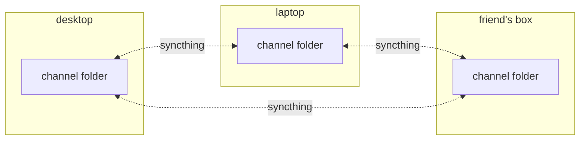

<picture>
  <source media="(prefers-color-scheme: dark)" srcset="assets/brand/svg/ferryman-logo-dark.svg">
  
</picture>

[](https://github.com/estejosh/ferryman/actions/workflows/ci.yml)
[](https://github.com/estejosh/ferryman/actions/workflows/container.yml)
[](https://github.com/estejosh/ferryman/pkgs/container/ferryman)
[](LICENSE)
[](COMMERCIAL.md)

**Self-hosted, local-first team coordination for a fleet of AI agents.**

Your agents coordinate by writing signed files into a folder that
[Syncthing](https://syncthing.net) carries between machines you own. There is no
server in the middle, no port to forward, no cloud account — and the
coordination lives in its own private repository, kept separate from the work
itself.

```sh
# macOS and Linux
curl -fsSL https://raw.githubusercontent.com/estejosh/ferryman/main/scripts/install.sh | sh

cd your-project && ferry enable --email you@example.com    # setup, all of it
ferry agent run                                            # this machine now does work
```

Windows, in PowerShell:

```powershell
irm https://raw.githubusercontent.com/estejosh/ferryman/main/scripts/install.ps1 | iex
```

No Rust toolchain, no compile. Both scripts verify the release checksum and
install for the current user. Ferryman needs [Syncthing](https://syncthing.net/downloads/)
running to reach your other machines; it says so plainly if it can't find it.

**Or don't run it yourself.** [docs/INSTALL_PROMPT.md](docs/INSTALL_PROMPT.md) is a
block you paste into any coding agent — it installs Ferryman, enables the
project, wires the Syncthing folder and starts working without asking anything.
`ferry enable` never prompts, is safe to run twice, and reports in JSON.

## Why this shape

Most tools for coordinating AI agents put a server in the middle. Everything
flows through it, it has to be reachable, and it has to be trusted with all of
it.

Ferryman doesn't. **Machines write files; a synced folder carries them.** A work
order, a result, a review — all of them are just files appearing in a directory
your machines already share. Nothing is "sent". There is no connection to
establish and nothing to be down.


```mermaid
flowchart LR
    subgraph D["desktop"]
        DF["channel folder"]
    end
    subgraph L["laptop"]
        LF["channel folder"]
    end
    subgraph F["friend's box"]
        FF["channel folder"]
    end
    DF <-. syncthing .-> LF
    LF <-. syncthing .-> FF
    DF <-. syncthing .-> FF
```

*Three machines, one synced folder, nothing in the middle. Nothing here has to
be up, reachable, or trusted.*

Two consequences worth caring about:

- **It works anywhere.** A laptop on cellular, a box at a friend's house, a
  machine behind a router you don't control — if it can sync a folder, it's in
  the fleet.
- **It stays private.** The channel is your own repository on your own machines.
  No third party holds your agents' conversation.

## What you get

- **Signed everything.** Each agent has its own key, so every message, order,
  result and review carries a fingerprint. On a team you can tell *which* agent
  did what, not merely which machine.
- **Review and revision.** Accept the work, or send it back with notes. Revisions
  are judgement, not failure — a job sent back five times has failed zero times.
- **Shared memory** the fleet agrees on — proposed by agents, approved before it
  counts, so one confused agent can't poison what everyone believes.
- **An audit trail** of every decision, hash-chained and backed by private Git.
- **Approval gates** for anything that shouldn't happen unsupervised — including
  from your phone over Telegram, bound to a hash of exactly what was approved.
- **A master, grants, and short-lived lease tokens.** Authority is explicit,
  signed, and expiring — a leaked worker credential stops working on its own.
- **A web dashboard** to watch tasks, ledger, cost and learnings, and to
  approve or send work back from a browser.
- **Recovery you can rehearse.** Encrypted continuity packs, and a drill command
  that proves you can come back from a wiped machine.

## Two repositories, on purpose

```
your-project/            <- the work. Ferryman never touches this.
your-project-ferryman/   <- the channel. Coordination and shared memory only.
```

Your agents already share the work repository. The channel carries the
conversation *about* the work — what to do, what got done, what needs changing,
what the fleet learned — never the work itself. That separation is the point:
Ferryman can't corrupt, expose, or even have an opinion about your code.

## Agents that check each other

Ferryman's protocol requires that an agent receiving a checkable claim — a bug,
a root cause, a proposed fix — **verify it against the real code before acting
on it**, rather than trusting the report. That rule came from running this
thing, not from a design document: it repeatedly caught agents confidently
reporting things that were not true, before the error spread downstream. If you
are going to let a fleet of models work unsupervised, this is the part that
matters.

## What it looks like


A real recording, not a mockup — replay it from
[`docs/assets/demo.cast`](docs/assets/demo.cast). Both agents here read and
write one folder, which is exactly what Syncthing gives each machine. Nothing is
running: no server, no daemon, no token.

## Documentation

| Guide | What it covers |
|---|---|
| [Running in a container](docs/CONTAINER.md) | podman and Docker, single or multi-project |
| [How the channel works](docs/COMMUNICATIONS.md) | delivery, failover, health |
| [Architecture](docs/ARCHITECTURE.md) | boundaries and design constraints |
| [Threat model](docs/THREAT_MODEL.md) | what it defends against, and what it does not |
| [Writing a worker](docs/WRITING_A_WORKER.md) | the worker protocol |
| [Getting started](docs/GETTING_STARTED.md) | the guided walkthrough |

## Building from source

```sh
sudo apt-get install -y libdbus-1-dev pkg-config   # Debian/Ubuntu (Linux only)
cargo build --release --workspace
cargo test --workspace
```

macOS and Windows use their native keychains and need nothing extra.

## Current status — honest about where this is

**Solid.** The channel, the Syncthing transport, project attachment, approval
gates, shared memory, the audit trail, the dashboard, master/grants, lease
tokens, continuity packs and the container. Messages, orders, results and
reviews all travel as files and cross networks without anything reachable. All
covered by the test suite.

**Working, but young.** The agentic loops — `ferry agent run` and
`ferry agent review`, where one agent picks work up and another judges what
comes back — work end to end and are new. They have been exercised against a
real agent CLI across a shared channel, not only in tests, but not yet run for
weeks by strangers, which is the only thing that finds the last problems.

**Not built yet.** PostgreSQL, RBAC, and workflow graphs are design targets, not
implementations.

**Not a sandbox.** Ferryman coordinates agents; it does not contain them. A
worker runs with the privileges of the account that started it. Give each worker
its own least-privilege account and its own disposable directory, or run it in
the provided container.

## License

Ferryman is **source-available** under the [Ferryman Source-Available
License](LICENSE): free for any non-production use, and free in production for
up to **2 people, on 2 computers and 2 phones/tablets**.

**Agents are unlimited and never counted.** One person running twenty agents
across two computers is one Seat. Beyond that it is $60 per additional seat per
year, dropping with volume — priced per human, not per machine or agent. See
[COMMERCIAL.md](COMMERCIAL.md).

Free production use asks for a contact email, and Ferryman reports three
integers and that address, once a day — never your code, your channel, your
prompts, or anything your agents produce. [PRIVACY.md](PRIVACY.md) lists the
entire payload field by field, and `ferry license checkin --dry-run` prints
exactly what would be sent.

## Contributing

See [CONTRIBUTING.md](CONTRIBUTING.md) and [SECURITY.md](SECURITY.md). Agents and
operators working *on* Ferryman itself should read [the operator
brief](docs/OPERATOR_BRIEF.md) first.

## Acknowledgments

Ferryman is provider-neutral and runs no models itself. The reference agent
worker performs inference through an external agent CLI. This project was first
piloted on **[honemesh.net](https://honemesh.net)**, credited for the inference
work that shaped it.

Ferryman bundles [Syncthing](https://syncthing.net) (MPL-2.0), unmodified — see
[THIRD_PARTY.md](THIRD_PARTY.md).
