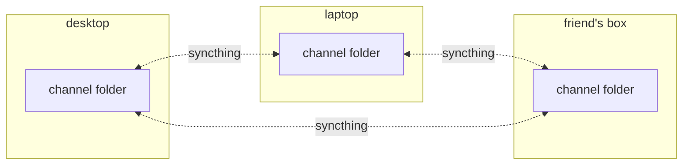
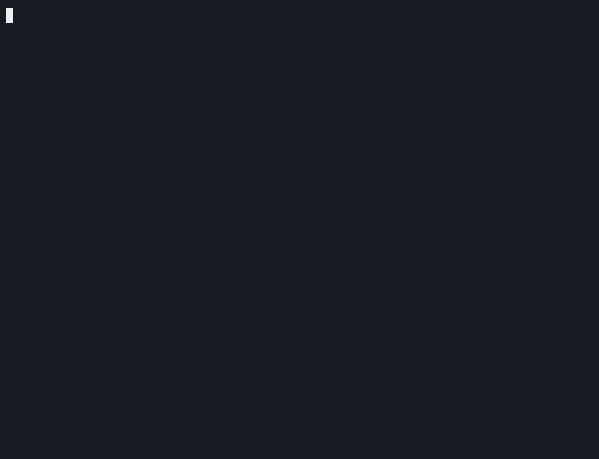

<picture>
  <source media="(prefers-color-scheme: dark)" srcset="assets/brand/svg/ferryman-logo-dark.svg">
  
</picture>

[](https://github.com/estejosh/ferryman/actions/workflows/ci.yml)
[](https://github.com/estejosh/ferryman/actions/workflows/container.yml)
[](https://github.com/estejosh/ferryman/pkgs/container/ferryman)
[](LICENSE)
[](COMMERCIAL.md)

**Self-hosted, local-first team coordination for a fleet of AI agents.**

Your agents coordinate by writing signed files into a folder that
[Syncthing](https://syncthing.net) carries between machines you own. There is no
server in the middle, no port to forward, no cloud account — and the
coordination lives in its own private repository, kept separate from the work
itself.

```sh
# macOS and Linux
curl -fsSL https://raw.githubusercontent.com/estejosh/ferryman/main/scripts/install.sh | sh

cd your-project && ferry enable --email you@example.com    # setup, all of it
ferry agent run                                            # this machine now does work
```

Windows, in PowerShell:

```powershell
irm https://raw.githubusercontent.com/estejosh/ferryman/main/scripts/install.ps1 | iex
```

No Rust toolchain, no compile. Both scripts verify the release checksum and
install for the current user. Ferryman needs [Syncthing](https://syncthing.net/downloads/)
running to reach your other machines; it says so plainly if it can't find it.

**Or don't run it yourself.** [docs/INSTALL_PROMPT.md](docs/INSTALL_PROMPT.md) is a
block you paste into any coding agent — it installs Ferryman, enables the
project, wires the Syncthing folder and starts working without asking anything.
`ferry enable` never prompts, is safe to run twice, and reports in JSON.

## Why this shape

Most tools for coordinating AI agents put a server in the middle. Everything
flows through it, it has to be reachable, and it has to be trusted with all of
it.

Ferryman doesn't. **Machines write files; a synced folder carries them.** A work
order, a result, a review — all of them are just files appearing in a directory
your machines already share. Nothing is "sent". There is no connection to
establish and nothing to be down.


```mermaid
flowchart LR
    subgraph D["desktop"]
        DF["channel folder"]
    end
    subgraph L["laptop"]
        LF["channel folder"]
    end
    subgraph F["friend's box"]
        FF["channel folder"]
    end
    DF <-. syncthing .-> LF
    LF <-. syncthing .-> FF
    DF <-. syncthing .-> FF
```

*Three machines, one synced folder, nothing in the middle. Nothing here has to
be up, reachable, or trusted.*

Two consequences worth caring about:

- **It works anywhere.** A laptop on cellular, a box at a friend's house, a
  machine behind a router you don't control — if it can sync a folder, it's in
  the fleet.
- **It stays private.** The channel is your own repository on your own machines.
  No third party holds your agents' conversation.

## What you get

- **Signed everything.** Each agent has its own key, so every message, order,
  result and review carries a fingerprint. On a team you can tell *which* agent
  did what, not merely which machine.
- **Review and revision.** Accept the work, or send it back with notes. Revisions
  are judgement, not failure — a job sent back five times has failed zero times.
- **Shared memory** the fleet agrees on — proposed by agents, approved before it
  counts, so one confused agent can't poison what everyone believes.
- **An audit trail** of every decision, hash-chained and backed by private Git.
- **Approval gates** for anything that shouldn't happen unsupervised — including
  from your phone over Telegram, bound to a hash of exactly what was approved.
- **Your phone as a terminal.** `ferry channel telegram` turns a message into a
  signed order and sends the result back when a worker submits it, so the fleet
  is reachable from the one device you always have. One Telegram group, a topic
  per project — Ferryman builds the topics and remembers which is which.
- **A master, grants, and short-lived lease tokens.** Authority is explicit,
  signed, and expiring — a leaked worker credential stops working on its own.
- **A web dashboard** to watch tasks, ledger, cost and learnings, and to
  approve or send work back from a browser.
- **Recovery you can rehearse.** Encrypted continuity packs, and a drill command
  that proves you can come back from a wiped machine.
- **Opt-in sandboxing.** Run each worker inside a fresh podman or docker
  container, with a network-egress policy (`net = none | open | <name>`) — one
  config line per project, at your direction.
- **A project cost estimator.** `ferry cost plan` sizes a project against
  per-engine list rates (editable in a `rates.toml`, no rebuild needed) so you can
  price work before committing to it. It is an **estimate from a token heuristic**,
  not a meter reading, and the rates are hand-maintained constants — check them
  against your provider's current pricing. `ferry cost project`, which is meant to
  total *recorded* usage, currently reports zero because nothing yet records
  per-run token counts; see [Known issues](#known-issues).

## Two repositories, on purpose

```
your-project/            <- the work. Ferryman never touches this.
your-project-ferryman/   <- the channel. Coordination and shared memory only.
```

Your agents already share the work repository. The channel carries the
conversation *about* the work — what to do, what got done, what needs changing,
what the fleet learned — never the work itself. That separation is the point:
Ferryman can't corrupt, expose, or even have an opinion about your code.

## Agents that check each other

Ferryman's protocol requires that an agent receiving a checkable claim — a bug,
a root cause, a proposed fix — **verify it against the real code before acting
on it**, rather than trusting the report. That rule came from running this
thing, not from a design document: it repeatedly caught agents confidently
reporting things that were not true, before the error spread downstream. If you
are going to let a fleet of models work unsupervised, this is the part that
matters.

## What it looks like



A real recording, not a mockup — replay it from
[`docs/assets/demo.cast`](docs/assets/demo.cast). Both agents here read and
write one folder, which is exactly what Syncthing gives each machine. Nothing is
running: no server, no daemon, no token.

## From your phone

```bash
export TELEGRAM_BOT_TOKEN=...        # from @BotFather
export TELEGRAM_APPROVER_ID=...      # your numeric user id; ask @userinfobot
ferry channel telegram --workspace ~/your-project-ferryman --agent you
```

Send a line and it becomes an open order; `/to <agent> <task>` addresses one
machine; `/status` and `/agents` read the channel back. Results arrive in the
same chat with their signature verdict.

For more than one project, point it at a map instead and it serves a whole
Telegram group — a topic per project, each wired to that project's channel:

```bash
ferry channel telegram --map ~/ferryman-comms/.tgferryman --agent you
```

The first run writes the map from the channels it finds, creates a topic for
each one, and writes down the ids — Telegram has no way to list topics, so that
file is the only record. See [docs/TELEGRAM_TOPICS.md](docs/TELEGRAM_TOPICS.md).

Only that one user id is obeyed — Telegram authenticates `from.id` server-side,
and the bridge refuses to start without an id to check, because a bridge that
started without one would take orders from whoever found the bot. Keep the token
in the environment or a mode-600 `EnvironmentFile`, never in the channel: it
syncs.

It writes the same signed artifacts `ferry channel order` writes, so it is not a
second control plane. Stop it and the fleet does not notice.

**Do not send secrets through it.** A Telegram cloud chat is not end-to-end encrypted, so a
token typed into one is stored on Telegram's servers and syncs to every device signed into
that account — and stays in that history indefinitely. Orders are meant to be shared; a
credential is not. Nothing in the code can tell the difference between a task and a token,
so this one is on you.

## Documentation

| Guide | What it covers |
|---|---|
| [Running in a container](docs/CONTAINER.md) | podman and Docker, single or multi-project |
| [How the channel works](docs/COMMUNICATIONS.md) | delivery, failover, health |
| [Architecture](docs/ARCHITECTURE.md) | boundaries and design constraints |
| [Threat model](docs/THREAT_MODEL.md) | what it defends against, and what it does not |
| [Writing a worker](docs/WRITING_A_WORKER.md) | the worker protocol |
| [Getting started](docs/GETTING_STARTED.md) | the guided walkthrough |

## Keeping a fleet on the same build

```sh
# in any repository you use Ferryman in
curl -fsSL https://raw.githubusercontent.com/estejosh/ferryman/main/scripts/ferry-up.sh | sh
```

Installs or updates `ferry`, attaches the repository if it isn't attached, and then
tells you where you stand: version **and commit** before and after, whether your
signing key is unchanged, and a signature check on every artifact. Safe to run twice,
and it never rotates a key — it prints the fingerprint before and after so you can see
that rather than take it on faith. Windows: `ferry-up.ps1`, same thing.

Run it on every machine, then compare the commit in `ferry --version`. If they differ,
they aren't running the same Ferryman — which is the cause of a whole class of problems
that otherwise look like bugs.

## Building from source

```sh
sudo apt-get install -y libdbus-1-dev pkg-config   # Debian/Ubuntu (Linux only)
cargo build --release --workspace
cargo test --workspace
```

macOS and Windows use their native keychains and need nothing extra.

## Soak testing — please break it

**Ferryman is in soak testing, and that is a request, not a disclaimer.**

It works. It is also new, and the last set of problems in software like this is
only ever found by other people running it on machines we do not have, for longer
than we have. So: run it, and tell us what happened.

```sh
ferry soak      # counts and category labels. Prints; sends nothing unless you ask.
```

Then [open an issue](https://github.com/estejosh/ferryman/issues/new?template=soak_report.md)
or email `lafamiliahale@gmail.com`. **"I ran it for a week and nothing broke" is a
real report and we want it** — it tells us which platforms and shapes of fleet are
holding up, which is not knowable any other way.

If you would rather not copy and paste, set `FERRYMAN_SOAK_URL` and run
`ferry soak --send`. That is per invocation and opt-in twice over: there is no config
key that sends on its own, no timer, and a downloaded release has no endpoint set.
`ferry soak --dry-run` prints exactly what `--send` would transmit, from the same
value, so the two cannot disagree.

`ferry soak` carries no file paths, task text, prompts, results, agent output or
credentials. It is built out of values whose *type* cannot hold them rather than
filtered afterwards, and the whole thing is
[one readable file](crates/ferryman-ops/src/soak.rs) if you would rather check that
than trust it.

Security issues go through
[private vulnerability reporting](https://github.com/estejosh/ferryman/security/advisories/new),
not public issues.

## Current status — honest about where this is

**Solid.** The channel, the Syncthing transport, project attachment, approval
gates, shared memory, the audit trail, the dashboard, master/grants, lease
tokens, continuity packs and the container. Messages, orders, results and
reviews all travel as files and cross networks without anything reachable. All
covered by the test suite.

**Working, but young.** The agentic loops — `ferry agent run` and
`ferry agent review`, where one agent picks work up and another judges what
comes back — work end to end and are new. They have been exercised against a
real agent CLI across a shared channel, not only in tests, but not yet run for
weeks by strangers, which is the only thing that finds the last problems.

**Not built yet.** PostgreSQL, RBAC, and workflow graphs are design targets, not
implementations.

### Known issues

Listed because you will hit some of these, and finding them written down beats
discovering them. Every one is something we know about and intend to fix; none of
them loses work or leaks anything.

- **Costs read as `$0.00`.** `ferry cost project` and the dashboard's *est. spend*
  tile compute from a per-run token count that nothing currently records, so they
  are structurally zero. Treat `ferry cost plan` (an estimate, and labelled as one)
  as the useful half and ignore the recorded totals until this is wired up.
- **Engine prices and quality scores are hand-typed constants.** `ferry cost rates`
  prints a table of list prices with no as-of date, an unrecognised engine is priced
  at a mid-range commercial rate — including a local model, which costs nothing —
  and the `quality` column is a static hint, not a measurement, wherever no
  outcomes have been recorded yet. Measured confidence *is* real and always shows
  its sample size (`0.67 · 1/1 accepted`); the priors beside it are opinion.
- **`ferry ask` reports its sources as signed without verifying them.** The ledger
  half is genuinely verified; agent-profile and task claims are read from the
  channel and attributed by filename. On a fleet you control this is cosmetic. Do
  not rely on it as provenance until it verifies, and prefer
  `ferry channel log` / `ferry channel tasks`, which do.
- **An addressed order reports as `claimed` before anyone picks it up.** `--to
  grouchly` shows as claimed by grouchly immediately, whether or not grouchly has
  started, because the holder is the assignee and no claim file is required. So
  "waiting for that machine" and "that machine is working" currently look the same.
- **`checkin = "off"` in `agent.toml` does nothing.** PRIVACY.md mentions it; no
  code reads it. Nothing sends automatically anyway — the check-in only ever runs
  when you run `ferry license checkin` — so leaving the URL unset is the control
  that actually works.
- **The SBOM omits the tray.** `sbom.cdx.json` covers the workspace, and
  `ferryman-tray` is excluded from the workspace with its own lockfile, so its
  dependencies are missing from it. The tray is optional and not installed by the
  install scripts.
- **`ferry bench --timeout-secs` is accepted and ignored.** The benchmark uses a
  fixed 300s per task.
- **The MCP client has no timeouts.** An external MCP server that hangs will block
  the gateway, and one that never answers at startup will stop `ferry mcp serve`
  from answering at all. Point it only at servers you trust to respond.
- **External MCP tool output is not marked as third-party** when it reaches an
  agent's prompt. Treat any MCP server you connect as something whose output can
  influence your agents, and prefer read-only ones.
- **Claude Code in `-p` mode aborts on substantial tasks.** Pointed at
  `@anthropic-ai/claude-code` as the engine, small tasks complete and larger ones fail
  with `Execution error` on stdout — `is_error: true`, `terminal_reason:
  aborted_streaming`, `stop_reason: tool_use`, typically at turn 8–12. It is
  intermittent and gets likelier the more work a task needs: "list the first three
  `unwrap()`s in this file" completes reliably, "list every place that could panic in
  this file" mostly does not. Eliminated as causes, each tested directly: tool
  permissions, the git worktree the worker runs in, the scrubbed child environment,
  Ferryman's stall watchdog and timeout, output volume (a run producing 6,709 output
  tokens succeeded while one producing 2,094 failed), the publishing notice in the
  prompt (identical failure with and without it), and the `renice +10` applied to the
  child. Failed runs cost nothing — they abort before or during the first request. The
  practical rule until this is understood: **scope orders to a handful of tool calls**.
  Bounded, specific tasks are what this is good at anyway.

- **Windows has less test coverage than Linux and macOS.** CI runs all three, but
  several suites are Unix-only, and the two most recent platform bugs were both
  Windows-only and both found by running on a real machine rather than in review.
- **The macOS test suite is currently red.** The macOS binaries build and are published
  on the release page, but `cargo test --workspace` fails there and the cause is not yet
  identified — the job was previously gated to tags, so it had never run against the
  work in this release. It now runs on every push. If you use Ferryman on a Mac, a soak
  report is especially valuable: nobody maintaining this has one.

Fixed in `0.4.0` and worth knowing if you ran an earlier build: a worker could kill
its own running task in an unrecoverable retry loop; a peer could forge another
machine's signing key through several CLI paths; the container runner put
credentials on the process argument list; the audit ledger reported itself tampered
after ordinary two-machine use; and shell task sources never worked on Windows. See
the changelog.

**Sandboxing is yours to turn on.** By default a worker runs with the privileges
of the account that started it. Point `sandbox` at an image in `agent.toml` (or
`ferry enable --sandbox IMAGE`) and Ferryman runs each worker inside a fresh
podman or docker container instead, with a network-egress policy so a hermetic
task can be cut off from the network entirely. The container path is built; the
per-platform bind-mount wrinkles (SELinux, macOS, WSL) are still being smoothed
out. If you don't direct it to sandbox, it doesn't.

## License

Ferryman is **source-available** under the [Ferryman Source-Available
License](LICENSE): free for any non-production use, and free in production for
up to **2 people, on 2 computers and 2 phones/tablets**.

**Agents are unlimited and never counted.** One person running twenty agents
across two computers is one Seat. Beyond that it is $60 per additional seat per
year, dropping with volume — priced per human, not per machine or agent. See
[COMMERCIAL.md](COMMERCIAL.md).

Free production use asks for a contact email, and Ferryman reports three
integers and that address, once a day — never your code, your channel, your
prompts, or anything your agents produce. [PRIVACY.md](PRIVACY.md) lists the
entire payload field by field, and `ferry license checkin --dry-run` prints
exactly what would be sent.

## Contributing

See [CONTRIBUTING.md](CONTRIBUTING.md) and [SECURITY.md](SECURITY.md). Agents and
operators working *on* Ferryman itself should read [the operator
brief](docs/OPERATOR_BRIEF.md) first.

## Acknowledgments

Ferryman is provider-neutral and runs no models itself. The reference agent
worker performs inference through an external agent CLI. This project was first
piloted on **[honemesh.net](https://honemesh.net)**, credited for the inference
work that shaped it.

Ferryman bundles [Syncthing](https://syncthing.net) (MPL-2.0), unmodified — see
[THIRD_PARTY.md](THIRD_PARTY.md).
