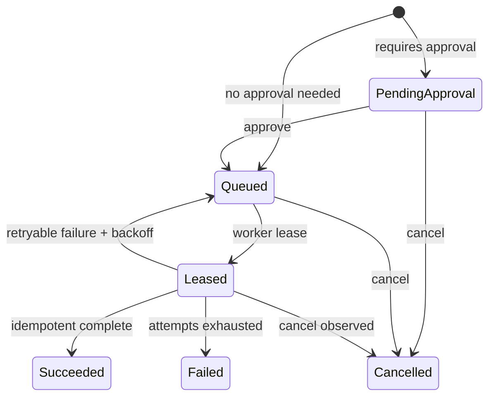

# Architecture

## Design constraints

The core orchestrates durable units of work; it does not execute models, decide a project's business logic, or claim to sandbox arbitrary native code. Local single-node correctness comes before distributed scale.

## v0.1 state machine

`jobs` and `events` are committed in one SQLite transaction. A lease is atomically claimed only when `available_at <= now`; expired leases become eligible for retry. Completion uses the lease ID as its idempotency key. This gives at-least-once delivery, so workers must make side effects idempotent.

## Boundaries

| Component | Responsibility | Does not do |
|---|---|---|
| API/control plane | auth, state transitions, audit/event stream, lease issue | run model prompts |
| Worker | execute a policy-scoped capability and produce output | access project-global credentials |
| Adapter | translate a declared capability to a provider | alter core job state directly |
| Artifact store | immutable content-addressed blobs plus metadata | inspect private content |

## Storage path

`Store` is the durable port. `SqliteStore` is v0.1's adapter and uses a short-lived connection per operation for simple restart-safe behavior. Its SQL and domain models deliberately avoid SQLite-only semantics except connection and migration setup, leaving a PostgreSQL implementation as a clean next adapter.

## Artifact mirrors

Local disk (or an opted-in mapped/network HDD) is authoritative. Google Drive is an optional post-write mirror: it writes only to a pre-existing folder supplied by ID and does not create public links or permissions. A Drive mirror failure is visible as an event but does not erase or invalidate the local artifact. MEGA is reserved for the same interface; it is not implemented until an explicit, supportable authentication and private-folder design is selected.

## Roadmap

1. PostgreSQL adapter, background lease reaper, per-worker signed job tokens.
2. DAG workflow compiler/executor with fan-out, joins, and human input signals.
3. OIDC/RBAC, encrypted secret provider interface, remote artifact stores, webhook adapter.
4. OTLP exporter, Prometheus scrape endpoint, dashboard, HA scheduler only after operational tests establish requirements.
