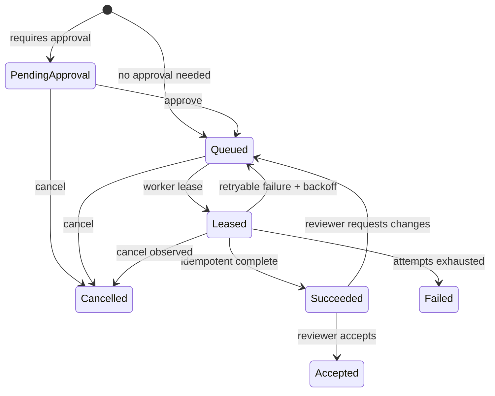

# Architecture

## Design constraints

The core orchestrates durable units of work; it does not execute models, decide a project's business logic, or claim to sandbox arbitrary native code. Per-machine correctness comes before fleet-wide scale, but the design is multi-machine from the start: the channel is a Syncthing-carried shared folder with a private-Git backstop, not a single-node store.

Ferryman is one application that runs on every machine in a fleet. Each attached project has an
outer machine-local `.ferryman` attachment and an inner portable
`.ferryman/ferryman` communications repository. Live message delivery uses
local filesystem, then a Syncthing-carried shared folder, then private Git as a
backstop. Git is deliberately last: it is an archive of record, not the live
channel. This subsystem is separate from encrypted recovery-pack
delivery; see [live communications](COMMUNICATIONS.md).

## Job state machine

```mermaid
stateDiagram-v2
  [*] --> PendingApproval: requires approval
  [*] --> Queued: no approval needed
  PendingApproval --> Queued: approve
  PendingApproval --> Cancelled: cancel
  Queued --> Leased: worker lease
  Leased --> Succeeded: idempotent complete
  Leased --> Queued: retryable failure + backoff
  Leased --> Failed: attempts exhausted
  Queued --> Cancelled: cancel
  Leased --> Cancelled: cancel observed
  Succeeded --> Accepted: reviewer accepts
  Succeeded --> Queued: reviewer requests changes
```

The last two transitions exist only for a job created with `requires_review`.
Without it, `Succeeded` is terminal and the review states are unreachable. With
it, `Succeeded` means *the worker is finished*, not *the work is done* — the job
waits for a reviewer to accept it or send it back.

Sending work back increments `revision` and returns the job to `queued`, so any
eligible worker can pick up the next round, not necessarily the one that did the
last. `request_changes` refuses empty notes: work never comes back without a
stated reason.

A revision is **not** a failure. It leaves `attempts` untouched and does not
count against `max_attempts`, because those exist to stop a job that keeps
crashing. A job sent back five times has failed zero times.

`jobs` and `events` are committed in one SQLite transaction. A lease is atomically claimed only when `available_at <= now`; expired leases become eligible for retry. Completion uses the lease ID as its idempotency key. This gives at-least-once delivery, so workers must make side effects idempotent.

## Boundaries

| Component | Responsibility | Does not do |
|---|---|---|
| API/control plane | auth, state transitions, audit/event stream, lease issue | run model prompts |
| Worker | execute a policy-scoped capability and produce output | access project-global credentials |
| Adapter | translate a declared capability to a provider | alter core job state directly |
| Artifact store | immutable content-addressed blobs plus metadata | inspect private content |

## Storage path

`Store` is the durable port. `SqliteStore` is v0.1's adapter and uses a short-lived connection per operation for simple restart-safe behavior. Its SQL and domain models deliberately avoid SQLite-only semantics except connection and migration setup, leaving a PostgreSQL implementation as a clean next adapter.

## Artifact mirrors

Local disk (or an opted-in mapped/network HDD) is authoritative. Google Drive is an optional post-write mirror: it writes only to a pre-existing folder supplied by ID and does not create public links or permissions. A Drive mirror failure is visible as an event but does not erase or invalidate the local artifact. MEGA remains available as an encrypted recovery target but is not an artifact mirror. This is separate from live communications, which moves over a Syncthing-carried folder and implements no cloud storage client at all.

## Roadmap

1. PostgreSQL adapter, background lease reaper, per-worker signed job tokens.
2. DAG workflow compiler/executor with fan-out, joins, and human input signals.
3. OIDC/RBAC, encrypted secret provider interface, remote artifact stores, webhook adapter.
4. OTLP exporter, Prometheus scrape endpoint, dashboard, HA scheduler only after operational tests establish requirements.
